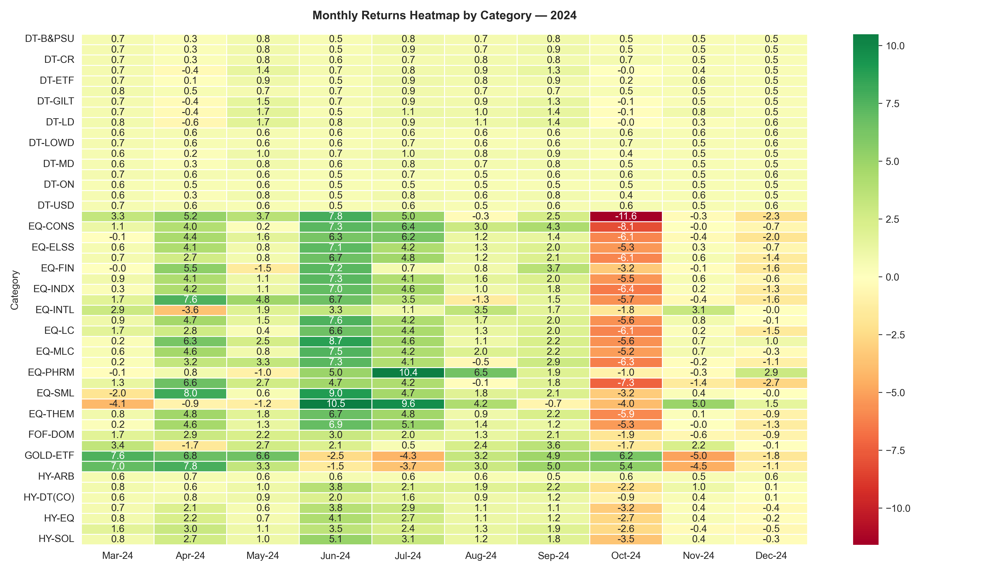
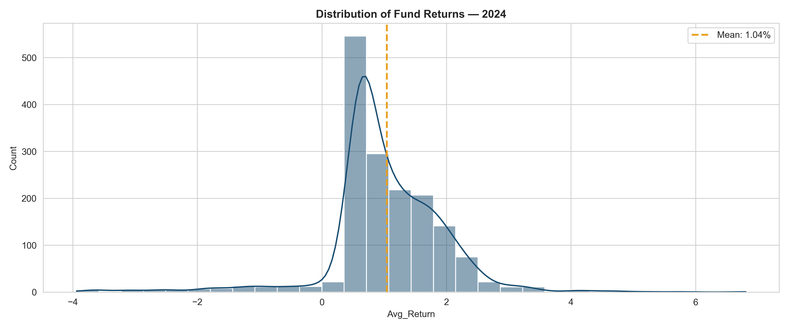
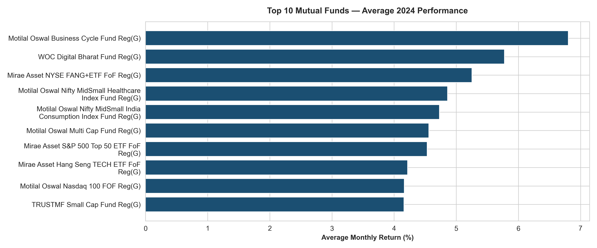
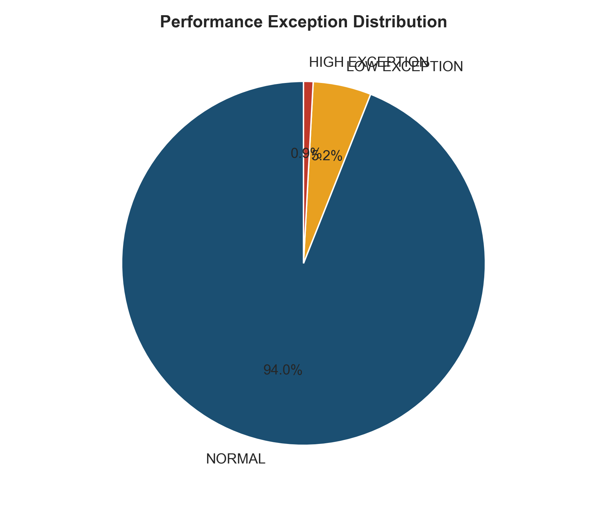

# 📊 Institutional Mutual Fund Performance Analytics (Python + Tableau)

> **End-to-End Asset Performance & Risk Framework**  
> **Author:** Shivaling Bidaragaddi | Performance Measurement Analyst  
> **LinkedIn:** [linkedin.com/in/shivaling-bidaragaddi](https://linkedin.com/in/shivaling-bidaragaddi)  
> **Live Tableau Dashboard:** [View Interactive Dashboard on Tableau Public](https://public.tableau.com/app/profile/shivaling.bidaragaddi/vizzes)

---

## 📌 Project Overview
This project transitions an exploratory data analysis (EDA) and automated risk-monitoring pipeline from **Python** into a production-ready, executive **Tableau BI Dashboard**. 

Designed around institutional asset evaluation workflows (modeled after State Street performance measurement practices), the framework evaluates 2024 historical fund returns, identifies top alpha-generating assets, models performance exception distributions, and visualizes macroeconomic market sector trends.

---

## 🛠️ Tech Stack & Key Deliverables

* **Programming & EDA:** Python (Pandas, NumPy, Matplotlib, Seaborn)
* **Business Intelligence:** Tableau Desktop / Tableau Public
* **Data Artifacts:** 
  * `Monthly Mutual Fund Returns 2024.csv` (Raw Kaggle Dataset)
  * `performance_summary.csv` (Engineered Feature Matrix)
* **Reporting Artifacts:** 
  * `fund_performance_analysis.pdf` (Automated Analytical Report)
  * `Mutual Fund Performance Analytics Dashboard.twbx` (Tableau Master Pack)

---

## 💻 Technical Implementation & Architecture

### 1. Programmatic Exploratory Data Analysis & Feature Engineering (Python)
* **Ingestion Pipelines:** Built data cleansing scripts using Python to normalize irregular text-heavy date column schemas into structured temporal data types.
* **Feature Engineering & Aggregation Correction:** Calculated categorical aggregate metrics, created exception risk flags (`HIGH`, `LOW`, `NORMAL`), and exported a performant, normalized `performance_summary.csv` optimized for BI visualization engines.
* **Exploratory Visual Suite:** Generated exploratory distribution plots (`boxplot_category.png`, `heatmap_category.png`, `return_distribution.png`, `exception_distribution.png`).

---

### 2. Executive BI Dashboard Architecture (Tableau)
The final interface leverages a standardized analytical grid built on an automatic executive viewport configuration:

* **Category Performance Heatmap:** A high-level view showing month-over-month percentage returns across individual fund styles.
* **Top 10 Funds Performance:** Granular horizontal bar chart isolating top-performing individual institutional assets.
* **Macro Market Trend Lines:** Rolling average momentum fluctuations across late 2024 execution cycles.
* **Category Return Baselines:** Vertical distribution rankings to compare category risk profiles.

---

## 🔍 Visual & Exploratory Data Assets

Below are the primary analytical charts generated during the Python EDA phase:

| Performance Heatmap | Return Distribution |
| :---: | :---: |
|  |  |

| Top 10 Fund Ranking | Exception Flag Distribution |
| :---: | :---: |
|  |  |

---

## 💡 Key Business Insights
* **Mathematical Accuracy in Aggregation:** Explicitly configured aggregate visual measures using statistical averages (`AVG`) rather than raw sums (`SUM`), preventing mathematical inflation of percentage returns during broad category rollup analyses.
* **Exception Investigation:** Automated exception tagging isolates outsized yield outliers ($>5\%$), directly replicating institutional custody exception audit routines.
* **Cross-Filtering Interactivity:** Integrated global action filters across the Tableau master heatmap, enabling dynamic drill-downs into specific asset tiers.

---

## 📁 Repository Structure

```text
Mutual-Fund-Performance-Analytics-Dashboard/
├── Monthly Mutual Fund Returns 2024.csv
├── Mutual Fund Performance Analytics Dashboard.twbx
├── README.md
├── boxplot_category.png
├── category_comparison.png
├── exception_distribution.png
├── fund_performance_analysis.pdf
├── heatmap_category.png
├── monthly_trend.png
├── performance_summary.csv
├── return_distribution.png
└── top10_funds.png
